# Projet Docker - Gestion de la liste des étudiants

## Auteurs
**Nom :** Haitam Lahlaouti

---

## 📌 Objectif du projet
Ce mini-projet a pour but de créer une API simple en Python qui expose une liste d'étudiants et leurs âges, de la conteneuriser avec Docker, de la déployer avec Docker Compose, et de pousser l'image vers un registre Docker privé visualisable via une interface graphique.

---

## 🧱 Prérequis
- Docker installé et actif
- Docker Compose installé
- Système basé sur Linux (Ubuntu recommandé)

---

## 🔧 Étapes du projet

### 1. Démarrage du service Docker
```bash
sudo systemctl start docker
sudo systemctl enable docker
```
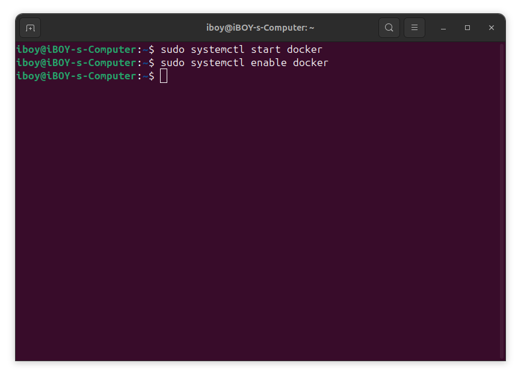

---

### 2. Création de l'image Docker pour l'API
Voici le `Dockerfile` utilisé :
```Dockerfile
FROM python:3
WORKDIR /usr/src/app
COPY requirements.txt ./
RUN pip install --no-cache-dir -r requirements.txt
COPY . .
CMD ["python", "./student_age.py"]
```
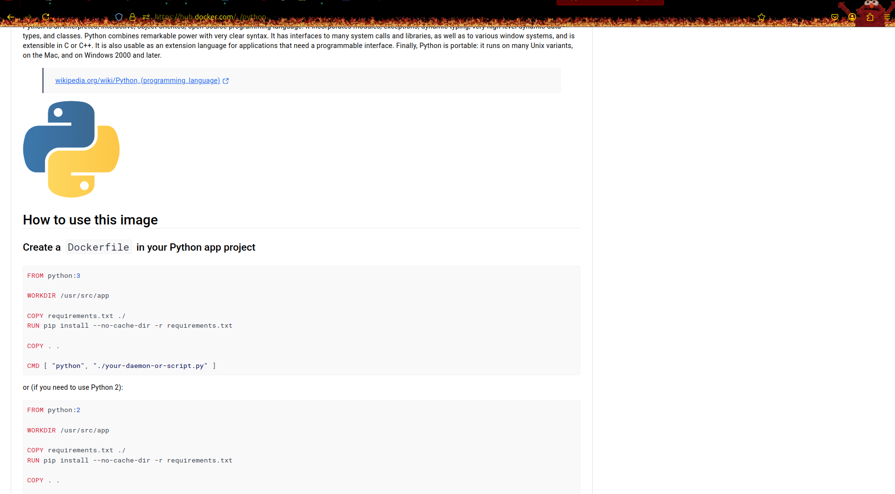
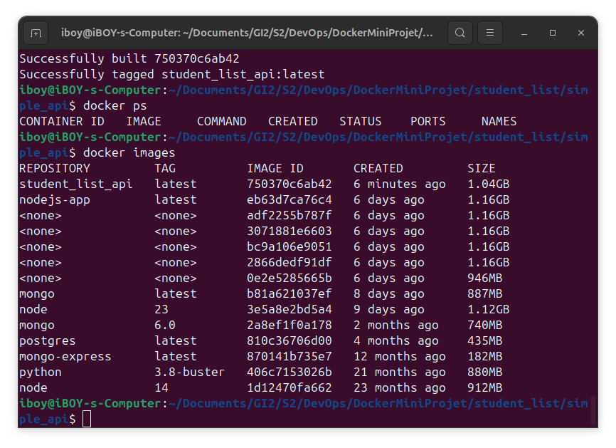

---

### 3. Vérification de l'image construite
```bash
docker images
```
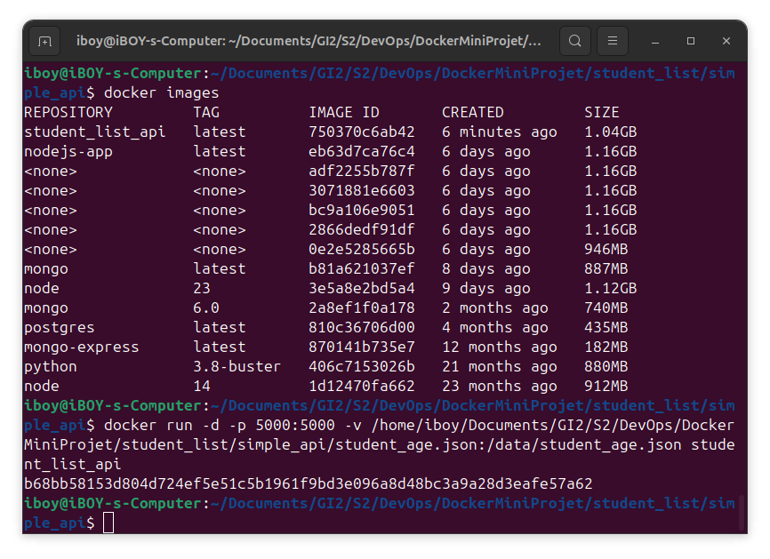

---

### 4. Lancement du conteneur avec Docker
```bash
docker run -d -p 5000:5000 -v $(pwd)/student_age.json:/data/student_age.json student_list_api
```
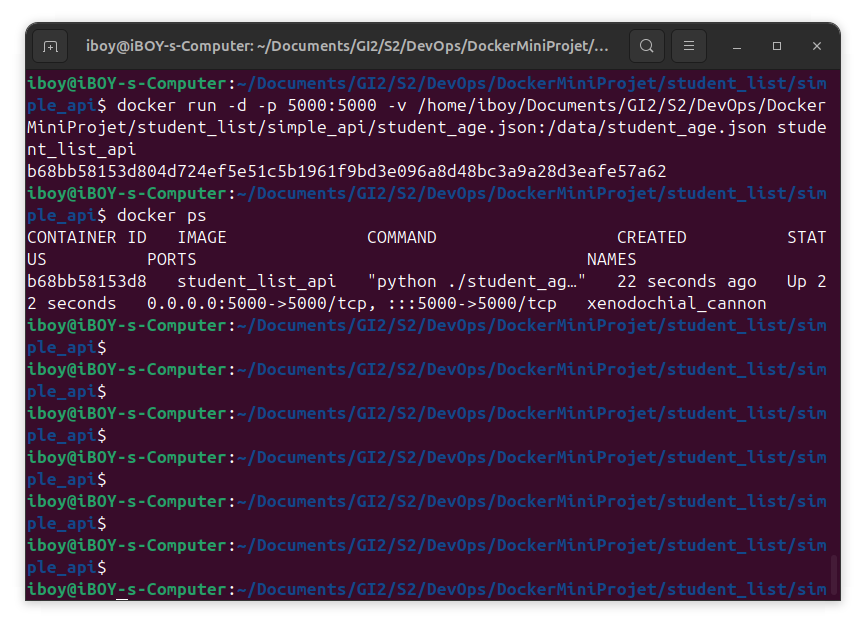

---

### 5. Vérification de l'état du conteneur
```bash
docker ps
```


---

### 6. Consultation des logs du conteneur
```bash
docker logs <CONTAINER_ID>
```
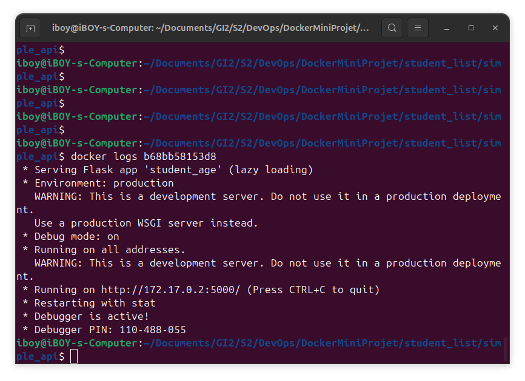

---

### 7. Test de l'API avec `curl`
```bash
curl -u root:root -X GET http://localhost:5000/supmit/api/v1.0/get_student_ages
```
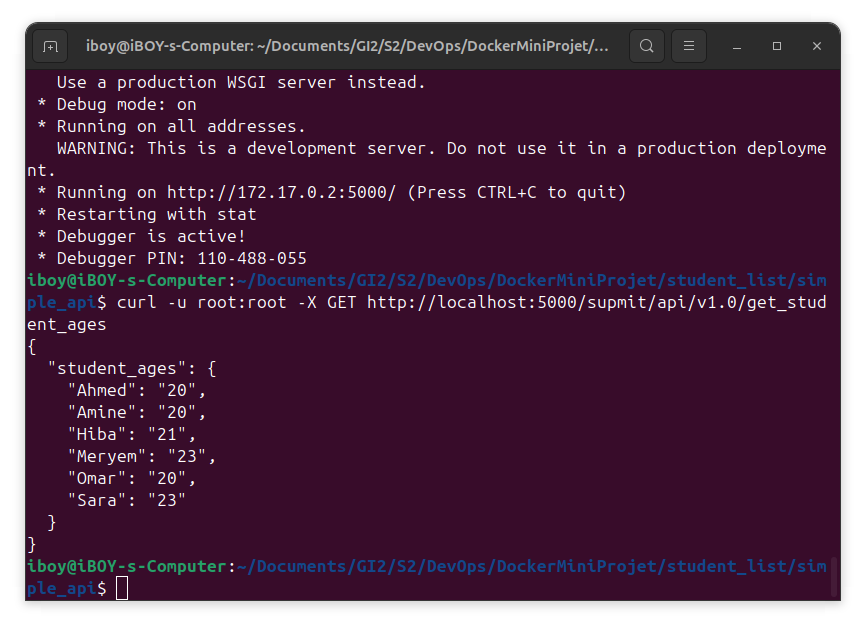

---

### 8. Utilisation de Docker Compose pour lancer plusieurs services
```bash
docker-compose up -d
```

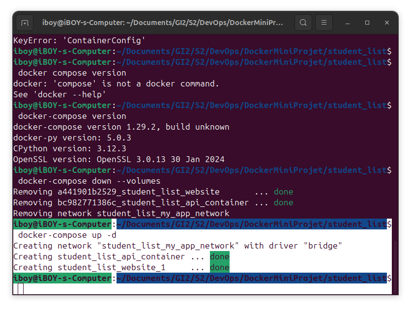


---

### 9. Affichage des conteneurs lancés
```bash
docker-compose ps
```
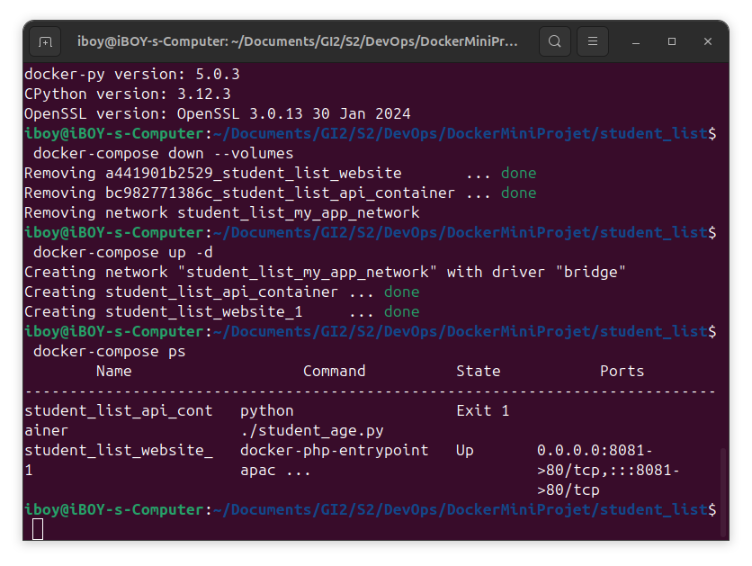

---

### 10. Interface Web PHP (client)
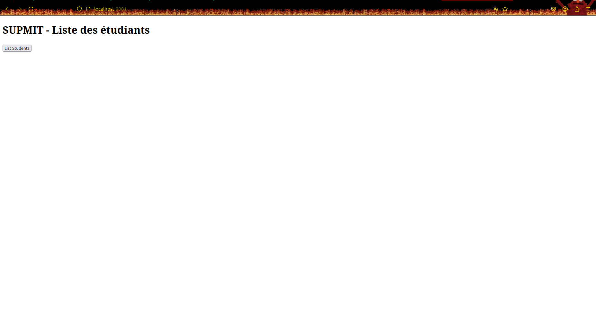
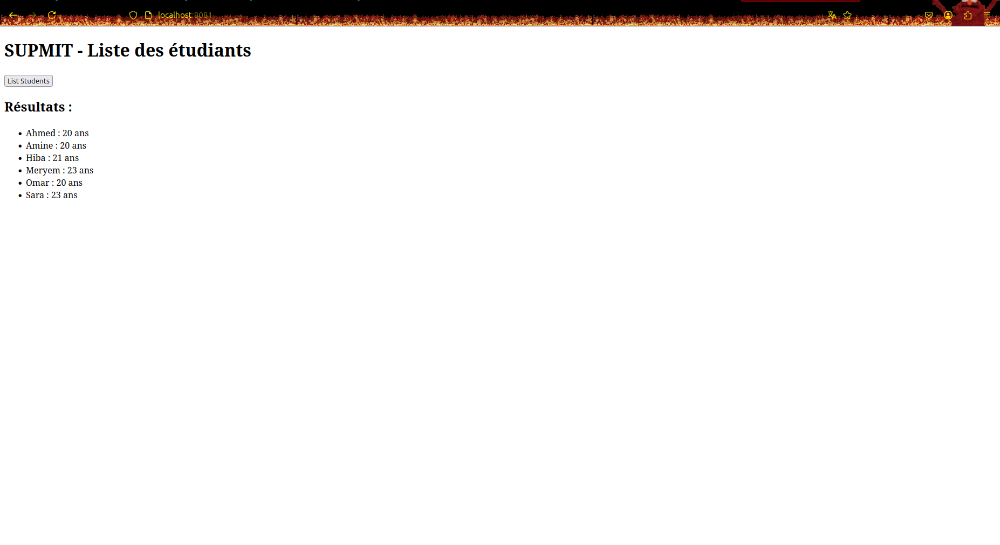

---

### 11. Mise en place du registre privé avec UI
```bash
docker-compose -f docker-compose-registry.yml up -d
```
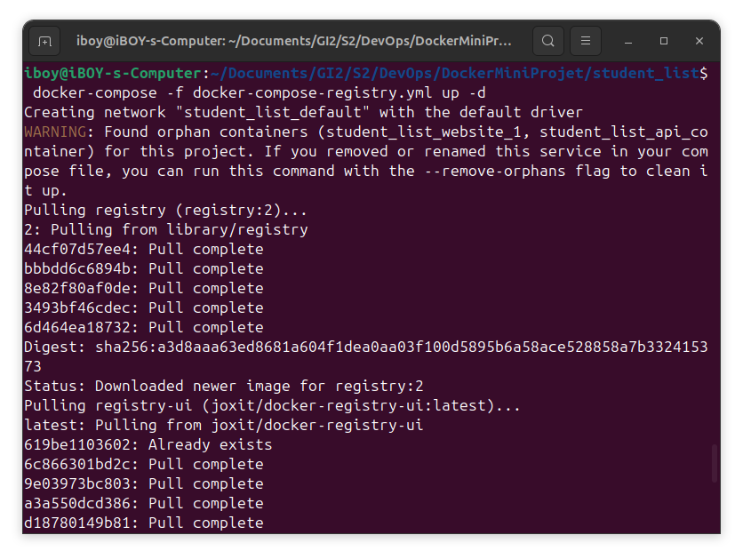

---

### 12. Accès à l’interface UI du registre
- Lien : http://localhost:8083
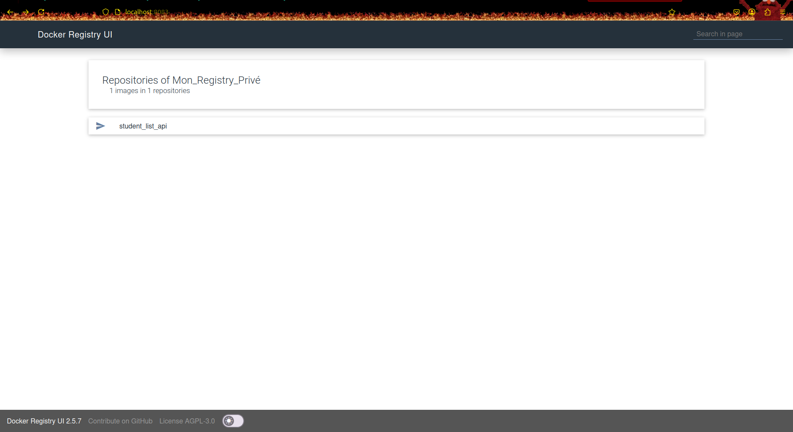
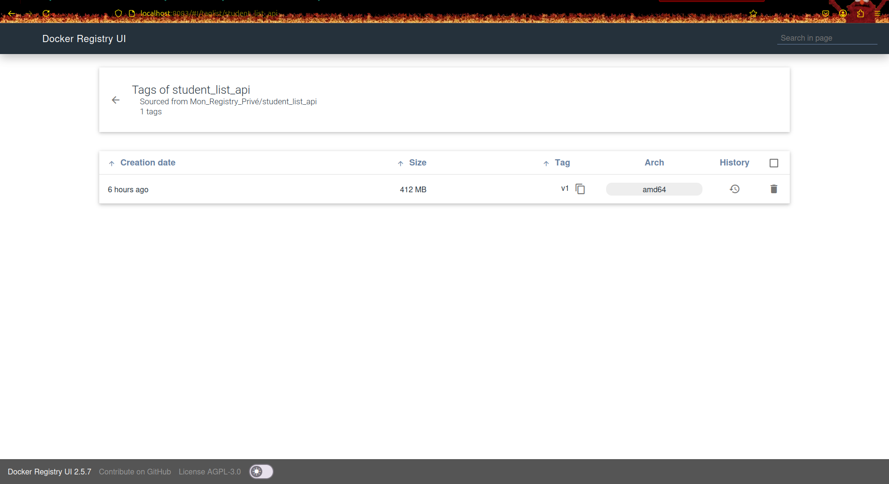

---

### 13. Push de l’image dans le registre
```bash
docker tag student_list_api localhost:5000/student_list_api

docker push localhost:5000/student_list_api
```

---
## 🚀 Pipeline CI/CD sous Jenkins

### 1. Présentation générale  
Pour automatiser l’intégration et le déploiement de l’API *student_list*, nous avons mis en place un **pipeline déclaratif Jenkins**.  
Chaque commit déclenche un build complet qui :

| Étape | Objectif | Résultat attendu |
|-------|----------|------------------|
| **Checkout SCM** | Récupération du dépôt GitHub | Code à jour dans l’agent Jenkins |
| **Build image** | Construction de l’image Docker de l’API | Image `student_list_api:latest` créée |
| **Test image** | Exécution de l’image et appel `curl` pour vérifier l’API | Retour JSON correct → succès |
| **Push to Docker Hub** | Publication de l’image si les tests sont verts | Tag `latest` mis à jour |
| **Post Actions** | Nettoyage de l’agent (prune d’image) | Espace disque libéré |

---

### 2. Configuration Jenkins

| Élément | Valeur / Action |
|---------|-----------------|
| **Image Jenkins** | `jenkins/jenkins:lts` exécutée dans un conteneur Docker |
| **Docker-in-Docker** | Montage : `-v /var/run/docker.sock:/var/run/docker.sock` |
| **CLI Docker** | Disponible dans le conteneur Jenkins (montage du binaire hôte) |
| **Réseau** | `--network host` pour simplifier les tests (pas de conflit de ports) |
| **Credentials** | *dockerhub-creds* (pair **ID / Secret**) pour l’authentification Docker Hub |
| **Volumétrie** | Dossier Jenkins persistant : `jenkins_home:/var/jenkins_home` |

---

### 3. Détail du `Jenkinsfile`

```groovy
pipeline {
    agent any

    environment {
        IMAGE_NAME      = 'student_list_api'
        DOCKERHUB_CREDS = credentials('dockerhub-creds')
    }

    stages {

        stage('Checkout') {
            steps {
                git 'https://github.com/iBOY011/mini-projet-docker.git'
            }
        }

        stage('Build image') {
            steps {
                sh 'docker build -t $IMAGE_NAME student_list/simple_api'
            }
        }

        stage('Test image') {
            steps {
                sh '''
                docker rm -f student_list_api_test || true

                CID=$(docker run -d --name student_list_api_test --network host \
                      -v $(pwd)/student_list/simple_api/student_age.json:/tmp/student_age.json:ro \
                      -e student_age_file_path=/tmp/student_age.json \
                      $IMAGE_NAME)

                # Attente que l’API réponde
                for i in {1..30}; do
                  curl -s -u root:root http://127.0.0.1:5000/supmit/api/v1.0/get_student_ages && break
                  sleep 1
                done

                docker rm -f $CID
                '''
            }
        }

        stage('Push to Docker Hub') {
            steps {
                sh '''
                echo $DOCKERHUB_CREDS_PSW | docker login -u $DOCKERHUB_CREDS_USR --password-stdin
                docker tag $IMAGE_NAME $DOCKERHUB_CREDS_USR/$IMAGE_NAME:latest
                docker push $DOCKERHUB_CREDS_USR/$IMAGE_NAME:latest
                '''
            }
        }
    }

    post {
        always {
            sh 'docker rmi $IMAGE_NAME || true'
        }
    }
}
```
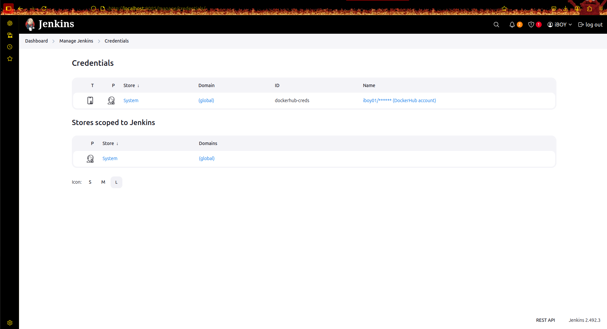
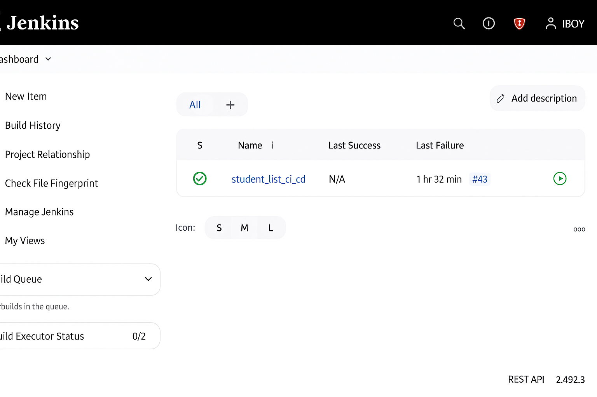
---


## 🌐 Déploiement sur AWS EC2

### Objectif
Déployer l'application conteneurisée sur une instance AWS EC2 pour la rendre accessible depuis Internet et valider le fonctionnement en environnement cloud.

### Configuration de l'instance AWS
- **Type d'instance** : t4g.micro (éligible au free tier)
- **Système d'exploitation** : Ubuntu 20.04 LTS (aarch64)
- **Architecture** : ARM64
- **Particularité** : Image Ubuntu minimisée (packages réduits)

---

### Étapes de déploiement

#### 1. Connexion à l'instance EC2
```bash
ssh ubuntu@<IP-EC2>
```
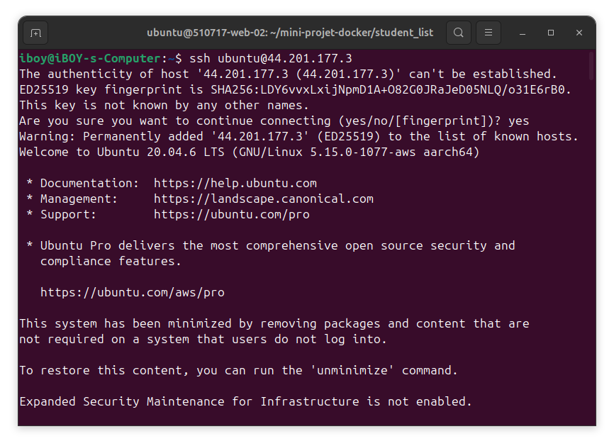

**Observation** : L'image Ubuntu est minimisée, nécessitant l'installation manuelle des outils requis.

---

#### 2. Installation de Docker et Docker Compose
```bash
# Mise à jour du système
sudo apt update

# Installation des prérequis
sudo apt install ca-certificates curl gnupg lsb-release

# Ajout de la clé GPG officielle Docker
curl -fsSL https://download.docker.com/linux/ubuntu/gpg | sudo gpg --dearmor -o /usr/share/keyrings/docker-archive-keyring.gpg

# Ajout du dépôt Docker
echo "deb [arch=$(dpkg --print-architecture) signed-by=/usr/share/keyrings/docker-archive-keyring.gpg] https://download.docker.com/linux/ubuntu $(lsb_release -cs) stable" | sudo tee /etc/apt/sources.list.d/docker.list > /dev/null

# Installation de Docker
sudo apt update
sudo apt install docker-ce docker-ce-cli containerd.io docker-buildx-plugin docker-compose-plugin

# Activation du service Docker
sudo systemctl enable --now docker

# Ajout de l'utilisateur au groupe docker
sudo usermod -aG docker ubuntu
newgrp docker
```
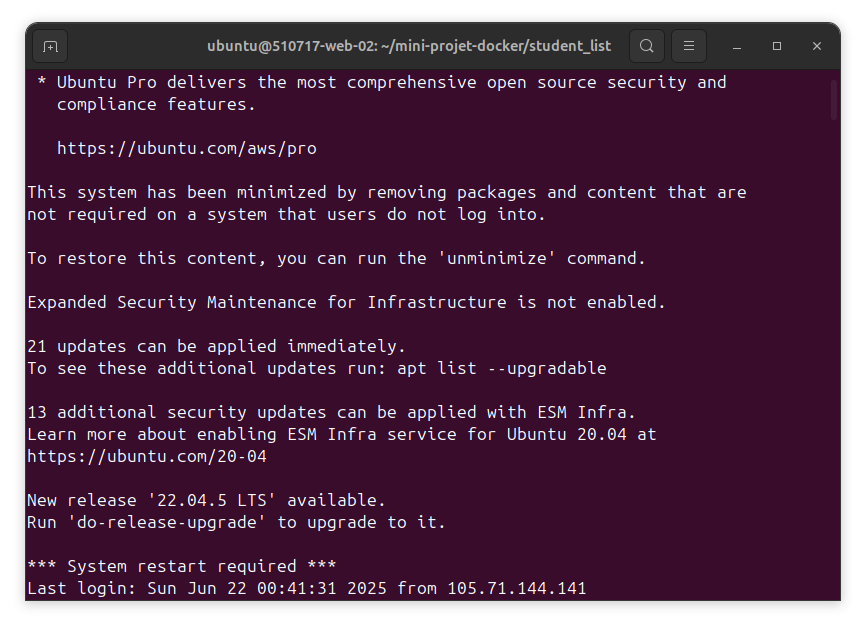
---

#### 3. Clonage du projet depuis GitHub
```bash
git clone https://github.com/iBOY011/mini-projet-docker.git
cd mini-projet-docker/student_list
```
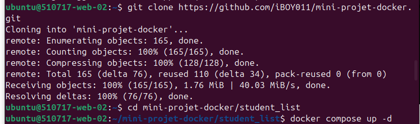

---

#### 4. Résolution du problème "pull access denied"
**Problème rencontré** : Le `docker-compose.yml` référençait une image `student_list_api` non disponible sur Docker Hub.

**Solution** : Construction de l'image localement
```bash
docker build -t student_list_api ./simple_api
```
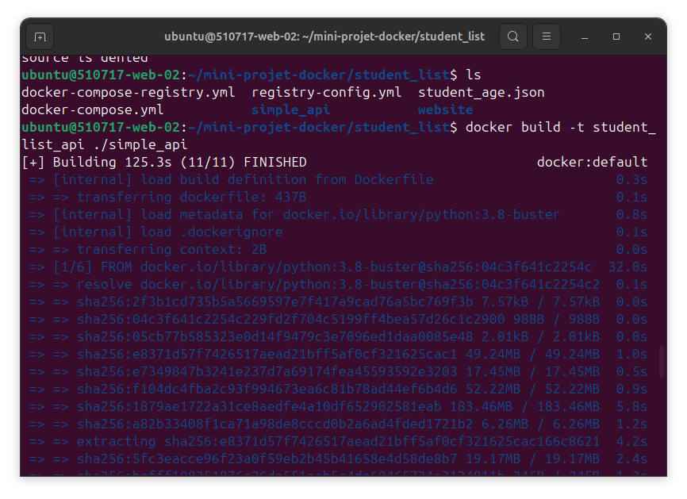

---

#### 5. Correction du problème de volume
**Problème** : Le fichier `docker-compose.yml` utilisait un chemin absolu inexistant sur la VM AWS.

**Correction** : Modification du volume pour utiliser un chemin relatif
```yaml
# Avant (chemin absolu - ne fonctionne pas sur AWS)
volumes:
  - /home/iboy/mini-projet-docker/student_list/website:/var/www/html

# Après (chemin relatif - fonctionne partout)
volumes:
  - ./website:/var/www/html
```

**Suppression** de la ligne obsolète `version: "3"` pour éliminer les warnings.

---

#### 6. Déploiement avec Docker Compose
```bash
docker compose up -d --force-recreate
```
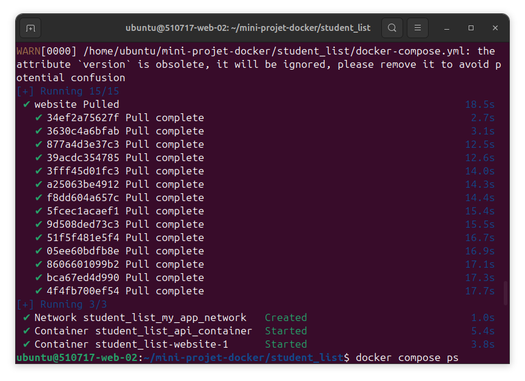

**Vérification des conteneurs** :
```bash
docker compose ps
```
Les deux services sont correctement démarrés :
- `student_list_api_container` (API Flask)
- `student_list-website-1` (Interface web PHP)

---

#### 7. Configuration des ports AWS (Security Group)
Ouverture des ports suivants dans le Security Group AWS :
- **Port 5000** : API Flask
- **Port 8081** : Interface web PHP
- **Port 8083** : Interface du registre Docker (optionnel)

---

#### 8. Tests fonctionnels sur AWS

**Test de l'API Flask** :
```bash
curl -u root:root -X GET http://localhost:5000/supmit/api/v1.0/get_student_ages
```
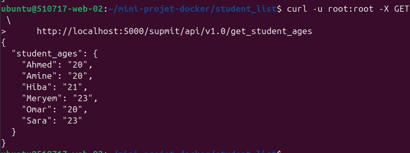

**Résultat** : L'API retourne correctement la liste des étudiants avec leurs âges au format JSON.

**Test de l'interface web** :
- Accès via : `http://<IP-EC2>:8081/`
- L'interface PHP interroge l'API via le réseau Docker interne
- Affichage correct de la liste des étudiants

---

### 🔧 Problèmes rencontrés et solutions

| Problème | Cause | Solution |
|----------|--------|----------|
| "pull access denied" | Image inexistante sur Docker Hub | Build local avec `docker build` |
| Site web 404 | Chemin absolu dans volume | Utilisation d'un chemin relatif |
| Image minimisée | AWS Ubuntu optimisée | Installation manuelle de Docker |
| Ports fermés | Security Group restrictif | Ouverture des ports 5000, 8081, 8083 |

---

### 📊 Résultats du déploiement AWS

✅ **API Flask** : Accessible sur `http://<IP-EC2>:5000`  
✅ **Interface web** : Accessible sur `http://<IP-EC2>:8081`  
✅ **Communication interne** : Réseau Docker fonctionnel  
✅ **Authentification** : Basic Auth (root:root) opérationnelle  
✅ **Données** : Volume JSON correctement monté  
✅ **Haute disponibilité** : Services redémarrés automatiquement  

---

### 🚀 Avantages du déploiement cloud

- **Accessibilité mondiale** : Application disponible 24h/24 depuis Internet
- **Scalabilité** : Possibilité d'augmenter les ressources selon le besoin
- **Isolation** : Conteneurs Docker garantissent la portabilité
- **Monitoring** : Logs AWS CloudWatch disponibles
- **Sécurité** : Contrôle fin des accès via Security Groups
- **Économique** : Instance t4g.micro éligible au free tier AWS

---

## 🧠 Conclusion

Ce projet nous a permis de mettre en pratique plusieurs compétences clés :

    Création d’une API REST simple avec Flask 🔧

    Conteneurisation avec Docker 🐳

    Automatisation avec Jenkins pour une pipeline CI/CD complète 🔁

    Gestion des erreurs réelles et résolution de bugs liés aux volumes, aux ports, et au timing de démarrage de conteneurs 🐞

    💡 Ce projet représente un excellent point de départ vers des workflows DevOps professionnels (CI/CD, Docker, tests, déploiement).

---

## 📷 Captures d’écran intégrées
Toutes les captures d'écran sont intégrées directement dans ce fichier README.md.

---

📎 [Lien vers le dépôt GitHub du projet](https://github.com/iBOY011/mini-projet-docker)


