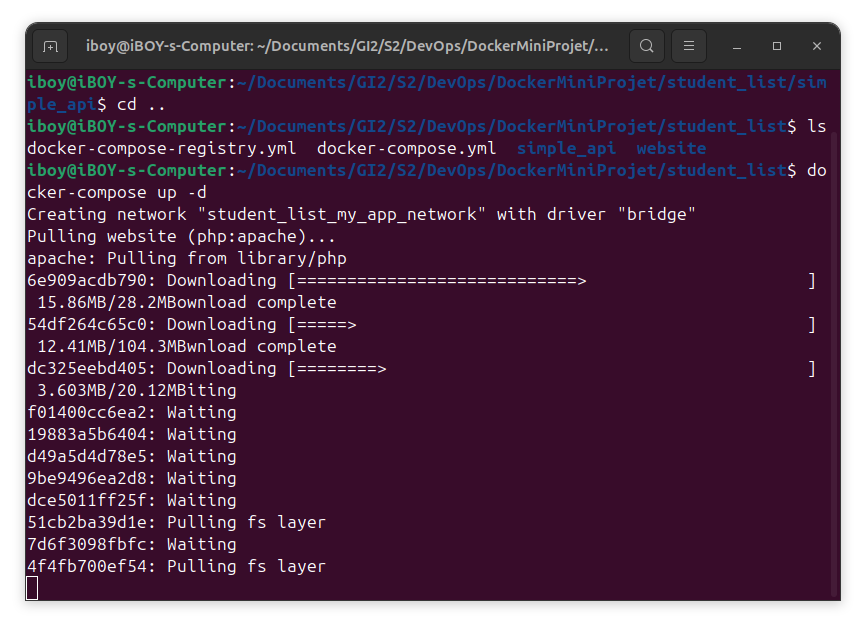

# Projet Docker - Gestion de la liste des étudiants

## Auteurs
**Nom :** Haitam Lahlaouti

---

## 📌 Objectif du projet
Ce mini-projet a pour but de créer une API simple en Python qui expose une liste d'étudiants et leurs âges, de la conteneuriser avec Docker, de la déployer avec Docker Compose, et de pousser l'image vers un registre Docker privé visualisable via une interface graphique.

---

## 🧱 Prérequis
- Docker installé et actif
- Docker Compose installé
- Système basé sur Linux (Ubuntu recommandé)

---

## 🔧 Étapes du projet

### 1. Démarrage du service Docker
```bash
sudo systemctl start docker
sudo systemctl enable docker
```


---

### 2. Création de l'image Docker pour l'API
Voici le `Dockerfile` utilisé :
```Dockerfile
FROM python:3
WORKDIR /usr/src/app
COPY requirements.txt ./
RUN pip install --no-cache-dir -r requirements.txt
COPY . .
CMD ["python", "./student_age.py"]
```


---

### 3. Vérification de l'image construite
```bash
docker images
```


---

### 4. Lancement du conteneur avec Docker
```bash
docker run -d -p 5000:5000 -v $(pwd)/student_age.json:/data/student_age.json student_list_api
```


---

### 5. Vérification de l'état du conteneur
```bash
docker ps
```


---

### 6. Consultation des logs du conteneur
```bash
docker logs <CONTAINER_ID>
```


---

### 7. Test de l'API avec `curl`
```bash
curl -u root:root -X GET http://localhost:5000/supmit/api/v1.0/get_student_ages
```


---

### 8. Utilisation de Docker Compose pour lancer plusieurs services
```bash
docker-compose up -d
```



---

### 9. Affichage des conteneurs lancés
```bash
docker-compose ps
```


---

### 10. Interface Web PHP (client)


---

### 11. Mise en place du registre privé avec UI
```bash
docker-compose -f docker-compose-registry.yml up -d
```


---

### 12. Accès à l’interface UI du registre
- Lien : http://localhost:8083


---

### 13. Push de l’image dans le registre
```bash
docker tag student_list_api localhost:5000/student_list_api

docker push localhost:5000/student_list_api
```

---

🚀 Intégration Continue & Déploiement (CI/CD)
Une pipeline CI/CD a été configurée avec Jenkins pour automatiser les étapes suivantes :

Clonage du dépôt Git
Build de l'image Docker de l'API
Test de l'API Flask avec un appel curl
Push automatique de l'image sur Docker Hub si le test est réussi

Exemple de pipeline Jenkinsfile
groovy
---

## 📁 Fichiers du projet

- `Dockerfile` : Construction de l'image Python
- `docker-compose.yml` : Déploiement de l’API + client web
- `docker-compose-registry.yml` : Déploiement du registre Docker privé avec UI

---

## ✅ Résultat final
Une API Flask Dockerisée avec une interface web fonctionnelle + une interface de registre privé consultable via navigateur.
Après exécution du pipeline sur Jenkins, l’application a été :

    Construite avec succès via un Dockerfile optimisé ✅

    Testée automatiquement avec un appel curl pour valider le fonctionnement de l’API ✅

    Déployée sur Docker Hub si l’API fonctionne correctement ✅

Le fichier JSON a bien été monté dans le conteneur grâce au volume Docker, et l’API retourne les bonnes données :
`{
`  "student_ages": {
`    "Ahmed": "20", 
`    "Amine": "20", 
 `   "Hiba": "21", 
 `   "Meryem": "23", 
 `   "Omar": "20", 
 `   "Sara": "23"
 ` }
`}


---

## 🧠 Conclusion

Ce projet nous a permis de mettre en pratique plusieurs compétences clés :

    Création d’une API REST simple avec Flask 🔧

    Conteneurisation avec Docker 🐳

    Automatisation avec Jenkins pour une pipeline CI/CD complète 🔁

    Gestion des erreurs réelles et résolution de bugs liés aux volumes, aux ports, et au timing de démarrage de conteneurs 🐞

    💡 Ce projet représente un excellent point de départ vers des workflows DevOps professionnels (CI/CD, Docker, tests, déploiement).

---

## 📷 Captures d’écran intégrées
Toutes les captures d'écran sont intégrées directement dans ce fichier README.md.

---

📎 [Lien vers le dépôt GitHub du projet](https://github.com/iBOY011/mini-projet-docker)


